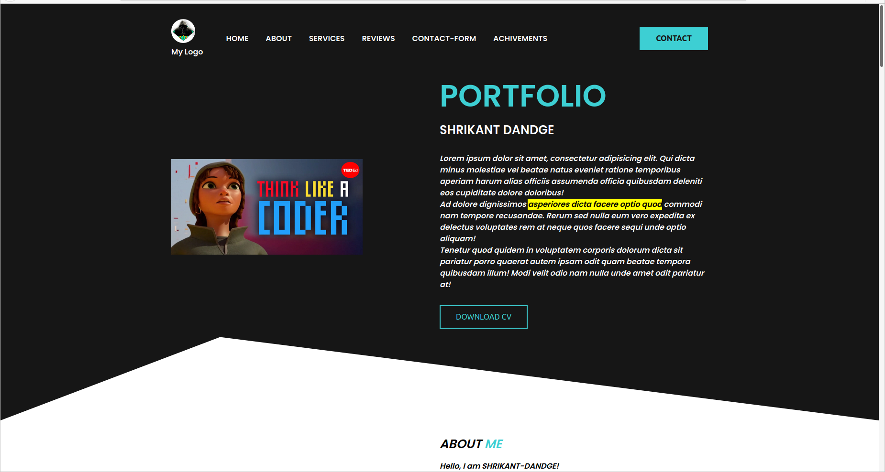
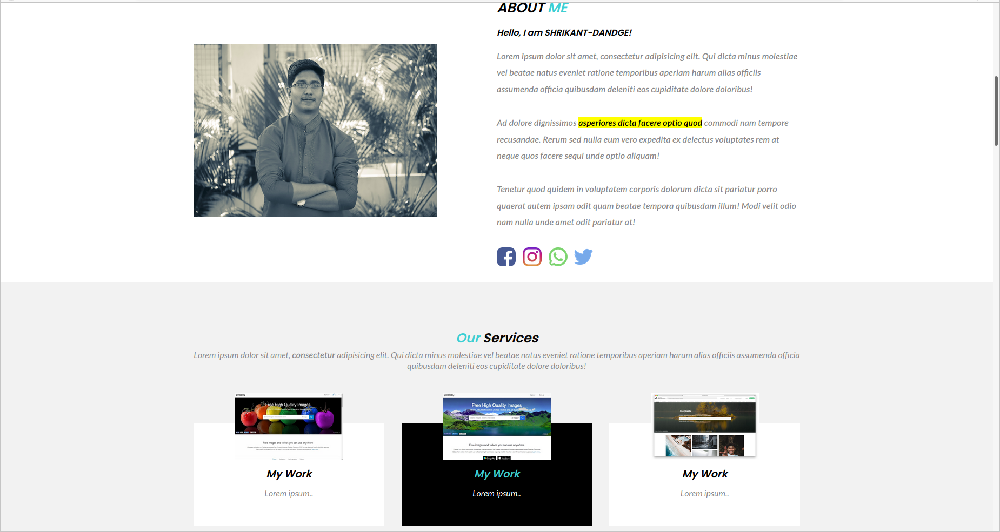
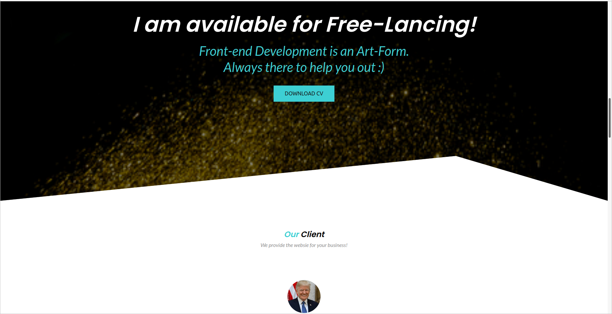
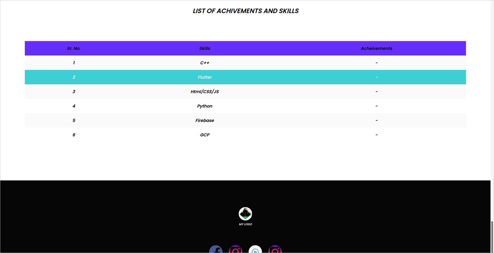

# Project 2: Add style to your previous project.

Refer [CSSZenGarden.com](http://www.csszengarden.com/) and understand how it works. Inspiring yourself from that website, add styling to your _Barebones_ HTML page from Project 1.

# Following are the snapshots of my project-2(PORTFOLIO)

