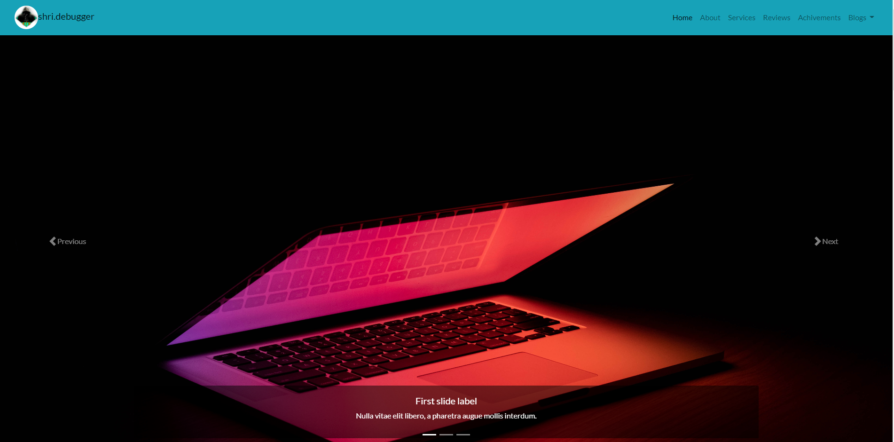
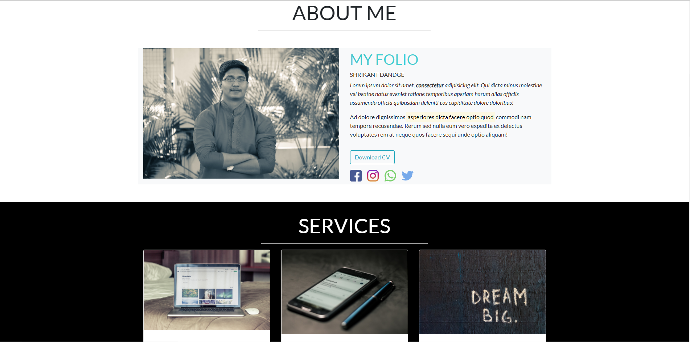
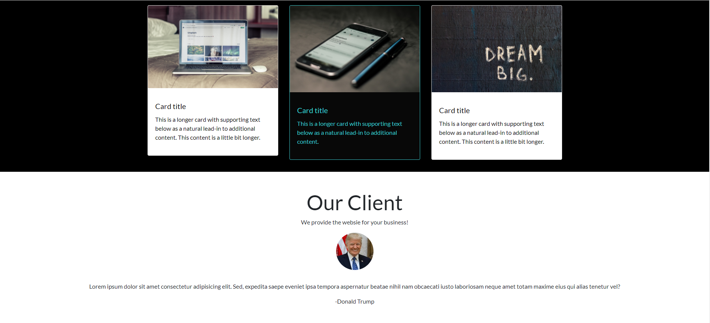
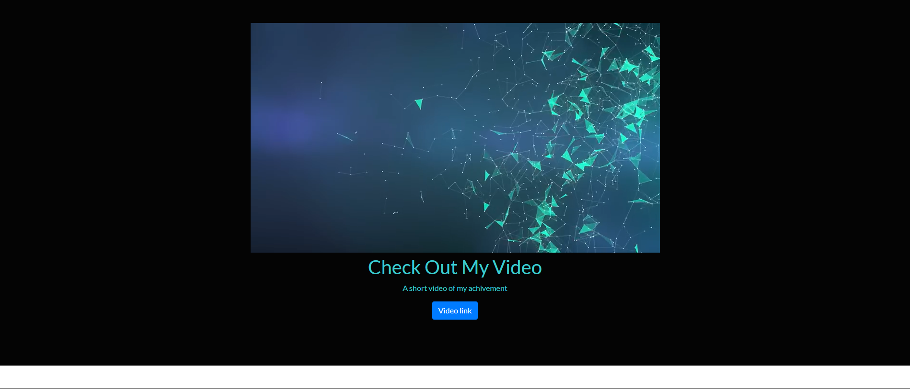
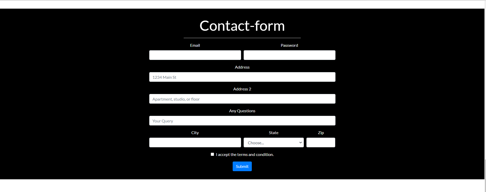
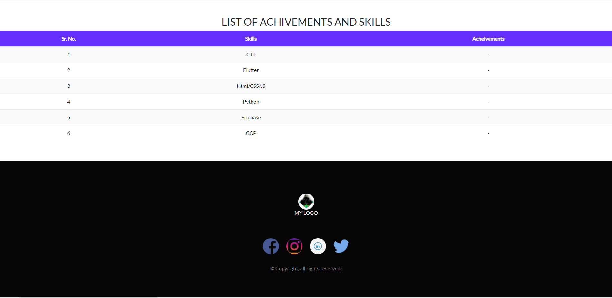

# Project 3: Bootstrap to recreate your old portfolio website

Now that you have added style to your portfolio site, it **lacks the modern feel** of a website made in 2020.

**Use Bootstrap** in addition to, or in replacement to, your CSS to make your website modern!

# Following are the snapshots of my project-2(PORTFOLIO)

